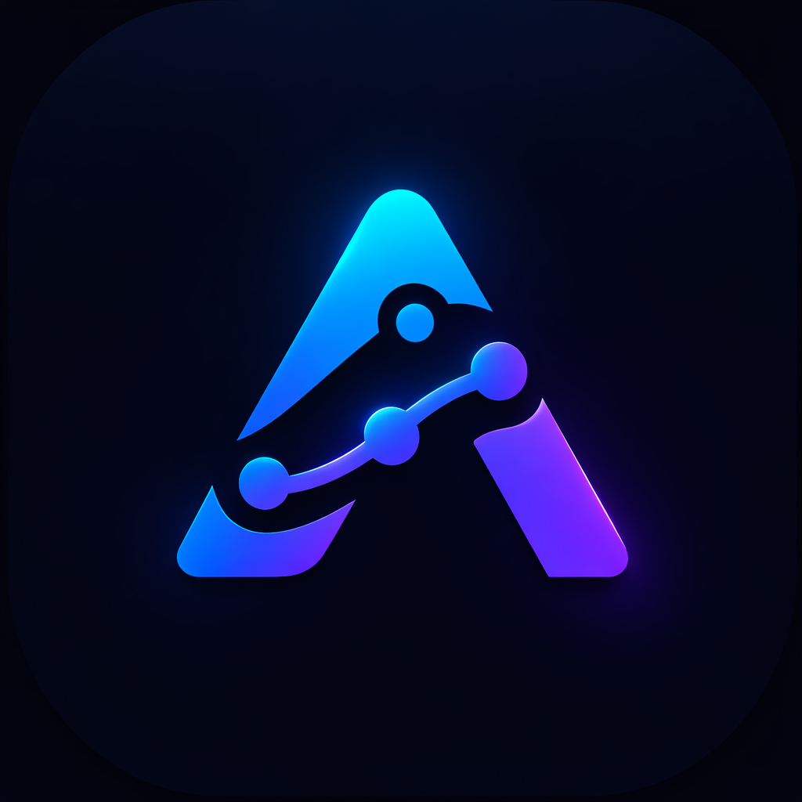
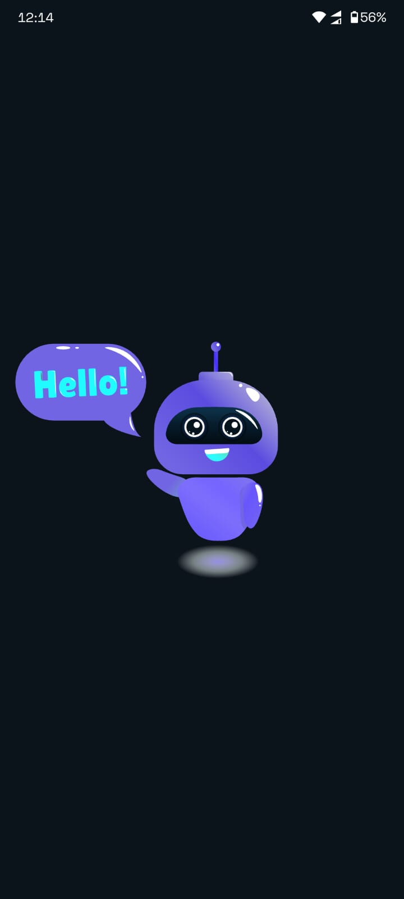
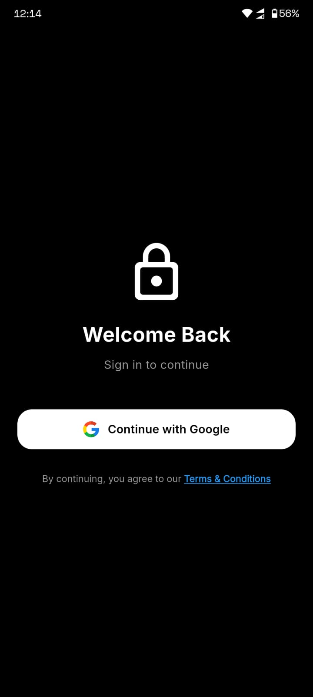
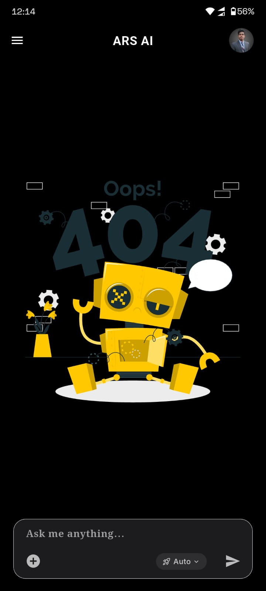
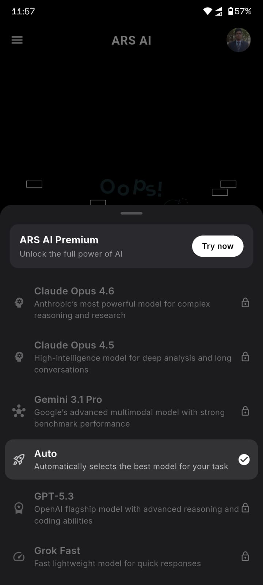

<div align="center">

# 🤖 ARS AI — Intelligent Chatbot App



**A powerful AI-powered chatbot application built with Flutter & Google Gemini**

[](https://flutter.dev)
[](https://firebase.google.com)
[](https://ai.google.dev)


</div>

---

## 📱 Overview

**ARS AI** is a modern, feature-rich AI chatbot application powered by **Google Gemini**. It supports multi-language conversations, persistent chat history via Firebase, and a beautifully designed adaptive UI for both light and dark modes.

---

## ✨ Features

| Feature | Description |
|---|---|
| 🔐 **Google Sign-In** | Secure authentication via Firebase Auth |
| 💬 **AI Chat** | Powered by Google Gemini AI |
| 🌙 **Dark / Light Mode** | Fully adaptive theme with system default support |
| 🗂️ **Chat History** | All conversations saved & synced via Firebase Firestore |
| 🌐 **Multi-language** | Auto-detects and responds in your language |
| 📧 **Contact Support** | In-app support form via EmailJS |
| 🔔 **Notifications** | Configurable notification preferences |
| ⭐ **Rate the App** | Built-in star rating & feedback screen |
| 🗑️ **Delete Account** | Full account & data deletion support |
| 💎 **Premium** | Premium upgrade screen |

---

## 🛠️ Tech Stack

- **Framework:** Flutter (Dart)
- **AI Engine:** Google Generative AI (Gemini)
- **Authentication:** Firebase Auth + Google Sign-In
- **Database:** Cloud Firestore
- **State Management:** Provider
- **Local Storage:** SharedPreferences
- **Email Service:** EmailJS (HTTP)
- **UI:** Google Fonts, Lottie Animations, Font Awesome Icons
- **Markdown Rendering:** flutter_markdown_plus

---

## 📂 Project Structure

```
lib/
├── main.dart                  # App entry point, theme setup
├── screens/
│   ├── splash_screen.dart     # Animated splash with auth check
│   ├── login_screen.dart      # Google Sign-In screen
│   └── home_screen.dart       # Main chatbot screen
├── page/
│   ├── menu.dart              # Sidebar / drawer menu
│   ├── delete_account.dart    # Account deletion screen
│   ├── premium.dart           # Premium upgrade screen
│   ├── notifications.dart     # Notification settings
│   ├── language.dart          # Language selection
│   ├── Privacy.dart           # Privacy policy
│   ├── Terms.dart             # Terms & conditions
│   ├── Rate_app.dart          # Star rating & feedback
│   ├── Help_faq.dart          # FAQ with search
│   └── Contact_support.dart   # Support form (EmailJS)
├── services/
│   └── auth_service.dart      # Firebase auth logic
└── provider/
    └── theme_provider.dart    # Theme state management
```

---

## 🚀 Getting Started

### Prerequisites

- Flutter SDK `^3.11.0`
- Dart SDK
- A Firebase project
- Google Gemini API key
- Android Studio / VS Code

### 1. Clone the Repository

```bash
git clone https://github.com/your-username/ars-ai.git
cd ars-ai
```

### 2. Install Dependencies

```bash
flutter pub get
```

### 3. Firebase Setup

1. Create a project at [Firebase Console](https://console.firebase.google.com/)
2. Enable **Authentication** → Google Sign-In
3. Enable **Cloud Firestore**
4. Download `google-services.json` → place in `android/app/`
5. Download `GoogleService-Info.plist` → place in `ios/Runner/`
6. Run:
```bash
flutterfire configure
```

### 4. Add Your API Keys

In `Contact_support.dart`, replace with your EmailJS credentials:
```dart
const _kServiceId  = 'YOUR_SERVICE_ID';
const _kTemplateId = 'YOUR_TEMPLATE_ID';
const _kPublicKey  = 'YOUR_PUBLIC_KEY';
```

### 5. Run the App

```bash
flutter run
```

---

## 📸 Screens

| Splash | Login | Chat Interface | Models |
|--------|-------|------|------|
|  |  |  |  |
---

## 🔒 Authentication Flow

```
App Launch
    │
    ▼
SplashScreen (3s Lottie)
    │
    ├── User Logged In? ──► HomeScreen (Chatbot)
    │
    └── Not Logged In? ──► LoginScreen ──► Google Sign-In ──► HomeScreen
```

---

## 🎨 Theme Support

ARS AI supports **three theme modes**:

- ☀️ **Light Mode** — Clean white UI
- 🌙 **Dark Mode** — Deep black (`#0B141A`) UI
- ⚙️ **System Default** — Follows device settings

Theme preference is **persisted** across app restarts via `SharedPreferences`.

---

## 📦 Dependencies

```yaml
firebase_core: ^4.5.0
firebase_auth: ^6.2.0
cloud_firestore: ^6.1.3
google_sign_in: ^6.3.0
google_generative_ai: ^0.4.7
provider: ^6.1.5+1
shared_preferences: ^2.5.4
lottie: ^3.3.2
google_fonts: ^8.0.2
flutter_markdown_plus: ^1.0.7
font_awesome_flutter: ^10.12.0
http: ^1.6.0
url_launcher: ^6.3.2
```

---

## 🛡️ Privacy & Security

- User data is stored securely in **Google Firebase**
- No personal data is sold to third parties
- Full account & data deletion available in-app
- All server communication uses **encrypted connections**

For more details, see the **Privacy Policy** screen in the app.

---

## 📋 Terms & Conditions

By using ARS AI, users agree to use the service lawfully and responsibly. AI-generated responses should not be treated as professional advice. See the **Terms & Conditions** screen in the app for full details.

---


## 📞 Support

Need help? Reach out via:

- 📱 **WhatsApp:** +880-1771-259478
- 📧 **In-App:** Menu → Contact Support

---

## 📄 License

```
Copyright © 2026 ARS AI. All rights reserved.
```

> ⚠️ **This project is proprietary and private.**
> 
> Unauthorized copying, distribution, modification, or use of this source code,
> in whole or in part, is strictly prohibited without the express written
> permission of the owner.
> 
> **All rights reserved.**

---

<div align="center">

**Made with ❤️ using Flutter & Google Gemini**

⭐ If you like this project, please give it a star!

</div>
